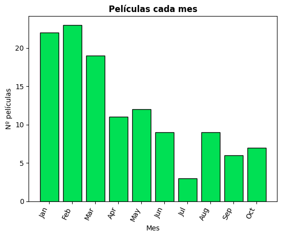
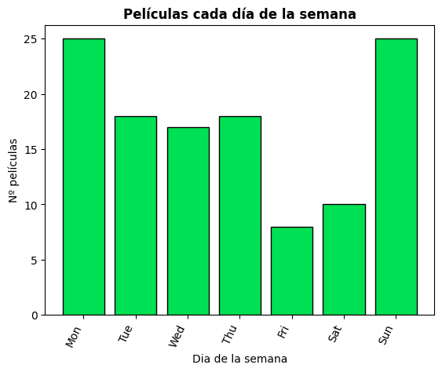
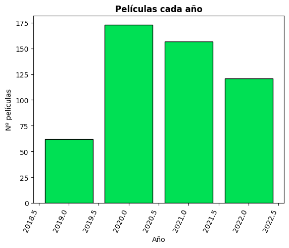
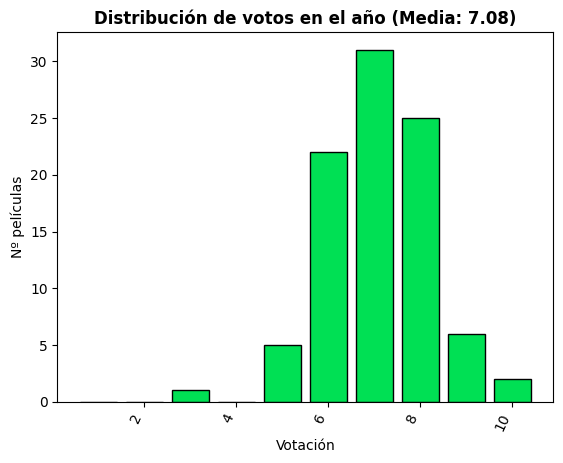

This is a tool for analyze the data of your Letterboxd history and represent it with plots.

# Installation
`pip install -r requirements.txt`

# How to use

#### Get the data
- Export your Letterboxd data as a zip from here.
#### Configuration
- Configure the `config.yaml`file
- Export the zip data in the `input_dir` directory
#### Run
`python3 main.py`

#### Run as a web service
1) `python3 serve.py`
2) Upload your .zip file in http://127.0.0.1:5001
3) This may not work correctly in a concurrent way if you use it simultaneously with different data
********************

# Some examples of the output
 - WordCloud of your reviews:

 

 - Distribution of films reviewed each month of the year:

 

 - Distribution of films reviewed each day of the week:

 

 - Distribution of films reviewed each year:

 

 - Distribution of the ratings given:

 
